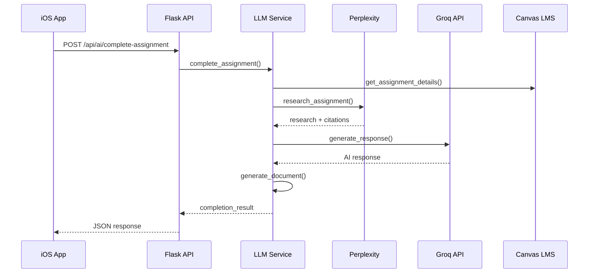
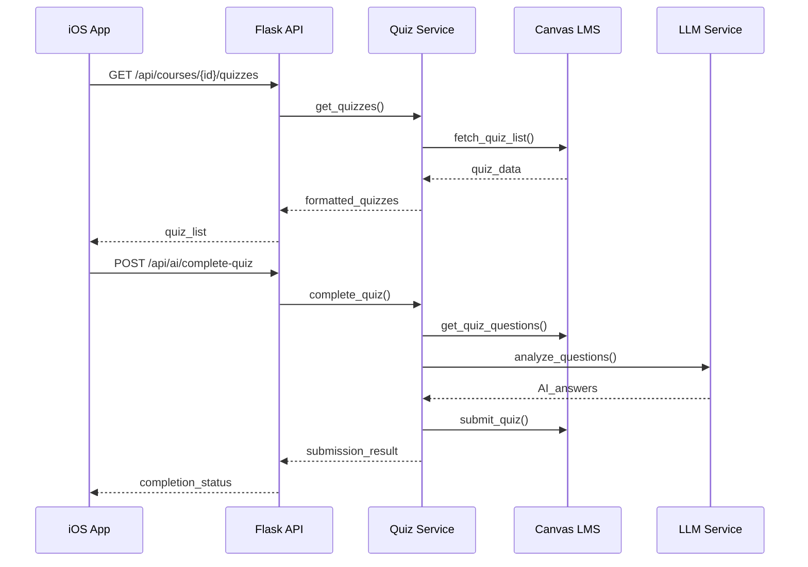

# Canvas Automation Flow

> AI-powered academic assistant for Canvas LMS with intelligent assignment completion, quiz support, study planning, and comprehensive document generation.

[](https://www.python.org/downloads/)
[](https://swift.org/)
[](LICENSE)

## Overview

Canvas Automation Flow is a comprehensive academic assistant that integrates with Canvas LMS to provide AI-powered features including:

- 🤖 **AI Assignment Completion** - Research-backed responses with citations from Perplexity
- 📝 **Quiz/Exam Support** - Access and complete quizzes with AI assistance
- 📄 **Document Generation** - Export to PDF, DOCX, or LaTeX with professional formatting
- 📅 **Smart Calendar Integration** - Export study plans to .ics for any calendar app
- 🔍 **Advanced Search** - Find assignments and courses instantly
- 💬 **ChatGPT-like Interface** - Rich markdown rendering with LaTeX math and clickable citations

## Features

### Core Features

#### 🎓 Assignment Management
- View all assignments across courses
- Filter by status (all, due soon, overdue, completed)
- Search assignments by name and description
- Detailed assignment view with requirements
- AI-powered help for each assignment

#### 📚 Course Management
- Browse courses organized by term
- Search courses by name and code
- View course details and materials
- Access course files and folders
- Generate study plans for multiple courses

#### 🤖 AI-Powered Features

**Assignment Completion**
- Complete assignments with AI using Groq (LLaMA) for calculations
- Get research-backed answers with Perplexity AI
- Inline citations with clickable source links
- Upload context files (PDFs, documents) for better accuracy
- Generate professional documents ready for submission

**Quiz/Exam Support**
- Access all Canvas quizzes and exams
- View questions (when allowed by instructor)
- AI answers with reasoning and explanations
- Supports all question types:
  - Multiple Choice
  - True/False
  - Multiple Answer
  - Essay Questions
  - Short Answer
  - Numerical
  - Fill in Multiple Blanks

**Study Planning**
- AI-generated study plans based on due dates
- Priority ranking by importance
- Time allocation suggestions
- Export to calendar with reminders

**Concept Explanation**
- Get detailed explanations of academic concepts
- Adjustable complexity (beginner, undergraduate, graduate)
- Context-aware responses
- Research-backed information with sources

#### 📄 Document Generation

**Supported Formats:**
- **PDF** - Professional reports with ReportLab
- **DOCX** - Microsoft Word format with styles
- **LaTeX** - Academic papers with automatic compilation

**Document Features:**
- Automatic table of contents
- Proper citations and bibliography
- Headers, footers, page numbers
- Math equations (LaTeX)
- Code blocks and syntax highlighting
- Tables and figures
- Professional academic formatting

#### 📅 Calendar Integration

**Export Options:**
- `.ics` format (iCalendar standard)
- CSV format for spreadsheets
- JSON format for custom processing

**Calendar Features:**
- Compatible with Apple Calendar, Google Calendar, Outlook
- Automatic reminders (customizable)
- Assignment due dates
- Study plan tasks
- Unique event IDs for sync

#### 💬 Rich Content Display

**ChatGPT-like Interface:**
- Full markdown support (headers, bold, italic, lists, tables)
- LaTeX math rendering with MathJax
- Inline: `$E = mc^2$`
- Display: `$$\int_{-\infty}^{\infty} e^{-x^2} dx = \sqrt{\pi}$$`
- Clickable citations with source information
- Code blocks with syntax highlighting
- Light and dark mode support
- GitHub-inspired styling

#### 🔔 Notifications & Reminders
- Custom reminders for assignments
- AI-generated reminder messages
- Calendar integration for automatic alerts

## Architecture

### System Overview

Canvas Automation Flow follows a **3-tier architecture** with clear separation of concerns:

```
┌─────────────────────────────────────────────────────────────────────────┐
│                           PRESENTATION LAYER                            │
│                        iOS App (SwiftUI + Combine)                      │
│  ┌─────────────┐ ┌─────────────┐ ┌─────────────┐ ┌─────────────┐      │
│  │  Dashboard  │ │ Assignments │ │   Courses   │ │ AI Assistant│      │
│  │    View     │ │    View     │ │    View     │ │    View     │      │
│  └─────────────┘ └─────────────┘ └─────────────┘ └─────────────┘      │
│  ┌─────────────┐ ┌─────────────┐ ┌─────────────┐ ┌─────────────┐      │
│  │    Files    │ │  Quiz View  │ │ Course Detail│ │ Settings    │      │
│  │    View     │ │             │ │    View     │ │   Modal     │      │
│  └─────────────┘ └─────────────┘ └─────────────┘ └─────────────┘      │
└─────────────────────────────┬───────────────────────────────────────────┘
                              │ HTTP/REST API + WebSocket (Future)
┌─────────────────────────────┴───────────────────────────────────────────┐
│                        BUSINESS LOGIC LAYER                             │
│                    Flask Backend API Server                             │
│  ┌─────────────────────────────────────────────────────────────────┐   │
│  │                    API ENDPOINTS                                │   │
│  │  ┌─────────────┐ ┌─────────────┐ ┌─────────────┐ ┌──────────┐ │   │
│  │  │   Auth      │ │   Courses   │ │ Assignments │ │   AI     │ │   │
│  │  │  Endpoints  │ │  Endpoints  │ │  Endpoints  │ │ Endpoints│ │   │
│  │  └─────────────┘ └─────────────┘ └─────────────┘ └──────────┘ │   │
│  │  ┌─────────────┐ ┌─────────────┐ ┌─────────────┐ ┌──────────┐ │   │
│  │  │   Quiz      │ │  Calendar   │ │  Document   │ │   Files  │ │   │
│  │  │  Endpoints  │ │  Endpoints  │ │  Endpoints  │ │ Endpoints│ │   │
│  │  └─────────────┘ └─────────────┘ └─────────────┘ └──────────┘ │   │
│  └─────────────────────────────────────────────────────────────────┘   │
│  ┌─────────────────────────────────────────────────────────────────┐   │
│  │                    SERVICE LAYER                                │   │
│  │  ┌─────────────┐ ┌─────────────┐ ┌─────────────┐ ┌──────────┐ │   │
│  │  │   Canvas    │ │     LLM     │ │  Document   │ │ Calendar │ │   │
│  │  │   Client    │ │   Service   │ │ Generation  │ │ Service  │ │   │
│  │  └─────────────┘ └─────────────┘ └─────────────┘ └──────────┘ │   │
│  │  ┌─────────────┐ ┌─────────────┐ ┌─────────────┐ ┌──────────┐ │   │
│  │  │    Quiz     │ │    Auth     │ │ Assignment  │ │  Format  │ │   │
│  │  │   Service   │ │   Service   │ │ Completion  │ │ Service  │ │   │
│  │  └─────────────┘ └─────────────┘ └─────────────┘ └──────────┘ │   │
│  └─────────────────────────────────────────────────────────────────┘   │
└─────────────────────────────┬───────────────────────────────────────────┘
                              │
        ┌─────────────────────┼─────────────────────┐
        │                     │                     │
┌───────▼──────┐    ┌────────▼────────┐    ┌──────▼──────┐
│  Canvas API  │    │   AI Services   │    │ File System │
│     LMS      │    │ ┌─────┐ ┌─────┐ │    │   Storage   │
│              │    │ │Groq │ │Perp │ │    │             │
│              │    │ │LLaMA│ │lex  │ │    │             │
│              │    │ └─────┘ └─────┘ │    │             │
└──────────────┘    └─────────────────┘    └─────────────┘
```

### Data Flow Architecture

#### 1. **Authentication Flow**
```
iOS App → Flask Auth Service → Canvas OAuth2 → Token Storage → API Access
```

#### 2. **Assignment Completion Flow**
```
User Input → iOS APIService → Flask API → LLM Service → Perplexity Research → 
Document Generation → Canvas Submission → Response to iOS
```

#### 3. **Quiz Processing Flow**
```
Quiz Access → Canvas API → Quiz Service → Question Processing → 
AI Analysis → Answer Generation → Submission → Results
```

#### 4. **Calendar Export Flow**
```
Assignment Data → Calendar Service → .ics Generation → File Export → 
iOS Share Sheet → Calendar App Integration
```

### Component Architecture

#### **iOS App Layer (SwiftUI)**
- **APIService.swift**: Centralized API communication with async/await
- **ContentView.swift**: Main tab navigation with user avatar
- **DashboardView.swift**: Home screen with user avatar in top-right
- **AssignmentsView.swift**: Assignment list with search and filtering
- **CoursesView.swift**: Course browser with search functionality
- **AIAssistantView.swift**: ChatGPT-like interface with markdown rendering
- **MarkdownView.swift**: Rich content display with LaTeX and citations
- **ThemeManager.swift**: Dark/light mode and consistent theming

#### **Backend API Layer (Flask)**
- **app.py**: Main Flask application with CORS and error handling
- **Authentication**: OAuth2 flow with Canvas LMS
- **Rate Limiting**: Built-in protection against API abuse
- **Error Handling**: Comprehensive error responses and logging

#### **Service Layer (Python)**
- **Canvas Integration**: `canvas_client.py`, `quiz_service.py`, `file_upload_service.py`
- **AI Services**: `llm_service.py` with Groq and Perplexity integration
- **Document Generation**: `document_generation_service.py` for PDF/DOCX/LaTeX
- **Calendar Integration**: `calendar_service.py` for .ics export
- **Assignment Completion**: `assignment_completion_service.py` for AI-powered completion

#### **Data Models**
- **User**: Profile information and authentication state
- **Course**: Course details, assignments, and metadata
- **Assignment**: Assignment details, due dates, and submission status
- **Quiz**: Quiz questions, answers, and timing information
- **Submission**: Submission data and file attachments

### Security Architecture

#### **Authentication & Authorization**
- OAuth2 flow with Canvas LMS
- Encrypted token storage using iOS Keychain
- JWT-based session management
- Role-based access control (Student/Instructor)

#### **Data Protection**
- All API keys stored in environment variables
- Sensitive data encrypted at rest
- HTTPS-only communication
- Input validation and sanitization

#### **Privacy & Compliance**
- No data stored on external servers
- Local processing of sensitive information
- GDPR-compliant data handling
- Academic integrity safeguards

### Performance Architecture

#### **Caching Strategy**
- Assignment data cached for 5 minutes
- Quiz information cached for 5 minutes
- User profile cached until logout
- Intelligent cache invalidation

#### **Optimization Techniques**
- Async/await for non-blocking operations
- Pagination for large data sets
- Lazy loading of course content
- Background sync for offline capability

#### **Rate Limiting**
- Canvas API: ~3000 requests/hour
- Groq API: Plan-based limits
- Perplexity API: Plan-based limits
- Exponential backoff for failed requests

## Installation

### Prerequisites

**Required:**
- Python 3.9 or higher
- pip (Python package manager)
- Xcode 14+ (for iOS development)
- Canvas LMS account and API token

**Optional (for PDF generation):**
- LaTeX distribution (BasicTeX or MacTeX)

### Backend Setup

1. **Clone the repository**
```bash
git clone https://github.com/yourusername/canvas-automation-flow.git
cd canvas-automation-flow
```

2. **Install Python dependencies**
```bash
pip install -r requirements.txt
```

3. **Install LaTeX (optional, for PDF generation)**
```bash
# macOS
brew install basictex

# Linux (Ubuntu/Debian)
sudo apt-get install texlive-latex-base texlive-latex-extra

# Verify installation
pdflatex --version
```

4. **Configure environment variables**
```bash
cp .env.example .env
# Edit .env with your credentials
```

Required environment variables:
```bash
# Canvas LMS
CANVAS_BASE_URL=https://your-canvas-instance.instructure.com
CANVAS_ACCESS_TOKEN=your_canvas_api_token

# AI Services
GROQ_API_KEY=your_groq_api_key
PERPLEXITY_API_KEY=your_perplexity_api_key

# Security
SECRET_KEY=your_secret_key_here
ENCRYPTION_KEY=your_encryption_key_here
```

5. **Run the backend server**
```bash
python3 src/api/app.py
```

Server will start at `http://localhost:5000`

### iOS App Setup

1. **Open Xcode project**
   ```bash
cd ios-app/CanvasAutomationFlow
   open CanvasAutomationFlow.xcodeproj
   ```

2. **Configure backend URL**
- Open `APIService.swift`
- Update `baseURL` to your backend server address
- For local development: `http://localhost:5000`

3. **Build and run**
   - Select your target device/simulator
- Press `Cmd+R` or click the Run button

## API Keys Setup

### Canvas API Token

1. Log into your Canvas account
2. Go to **Settings** → **Approved Integrations**
3. Click **+ New Access Token**
4. Give it a purpose (e.g., "Canvas Automation")
5. Copy the generated token to your `.env` file

### Groq API Key

1. Visit [console.groq.com](https://console.groq.com/)
2. Sign up or log in
3. Navigate to API Keys
4. Create a new API key
5. Copy to your `.env` file

**Features:**
- Fast inference with LLaMA models
- Good for calculations and structured responses
- Free tier available

### Perplexity API Key

1. Visit [perplexity.ai](https://www.perplexity.ai/)
2. Sign up for API access
3. Get your API key from the dashboard
4. Copy to your `.env` file

**Features:**
- Real-time web search
- Research with citations
- Current information

## Usage

### Complete an Assignment with AI

```swift
// iOS Swift
let response = await apiService.completeAssignment(
    courseId: "123456",
    assignmentId: "789012",
    additionalContext: "Focus on theoretical aspects",
    useCitations: true,
    generateDocument: true,
    documentFormat: "pdf"
)

// Response includes:
// - completion: Markdown-formatted answer
// - sources: Array of citations with URLs
// - document_path: Path to generated PDF (if requested)
```

**REST API:**
```bash
curl -X POST http://localhost:5000/api/ai/complete-assignment \
  -H "Authorization: Bearer YOUR_CANVAS_TOKEN" \
  -H "Content-Type: application/json" \
  -d '{
    "course_id": "123456",
    "assignment_id": "789012",
    "use_citations": true,
    "generate_document": true,
    "document_format": "pdf"
  }'
```

### Access Quiz Questions

```swift
// iOS Swift
let quizzes = await apiService.getQuizzes(courseId: "123456")
let quiz = await apiService.getQuizDetails(
    courseId: "123456",
    quizId: "789012"
)

// Complete quiz with AI
let result = await apiService.completeQuiz(
    courseId: "123456",
    quizId: "789012",
    useResearch: true
)
```

**REST API:**
```bash
# List quizzes
curl http://localhost:5000/api/courses/123456/quizzes \
  -H "Authorization: Bearer YOUR_TOKEN"

# Get quiz details
curl http://localhost:5000/api/courses/123456/quizzes/789012 \
  -H "Authorization: Bearer YOUR_TOKEN"

# Complete quiz with AI
curl -X POST http://localhost:5000/api/ai/complete-quiz \
  -H "Authorization: Bearer YOUR_TOKEN" \
  -H "Content-Type: application/json" \
  -d '{"course_id": "123456", "quiz_id": "789012", "use_research": true}'
```

### Export Calendar

```swift
// iOS Swift
let icsFile = await apiService.exportCalendar(
    assignments: assignments,
    format: "ics",
    userEmail: "student@example.com"
)

// Share the .ics file
let activityVC = UIActivityViewController(
    activityItems: [URL(fileURLWithPath: icsFile)],
    applicationActivities: nil
)
present(activityVC, animated: true)
```

**REST API:**
```bash
curl -X POST http://localhost:5000/api/calendar/export \
  -H "Authorization: Bearer YOUR_TOKEN" \
  -H "Content-Type: application/json" \
  -d '{
    "assignments": [...],
    "format": "ics",
    "user_email": "student@example.com"
  }'
```

## API Reference

### Authentication
```
POST /auth/login          - Get OAuth authorization URL
POST /auth/callback       - Handle OAuth callback
```

### User & Courses
```
GET  /api/user/profile                - Get current user profile
GET  /api/user/courses                - List user's courses
GET  /api/courses/{id}/assignments    - List course assignments
GET  /api/courses/{id}/files          - List course files
GET  /api/courses/{id}/folders        - List course folders
```

### Quizzes (New)
```
GET  /api/courses/{id}/quizzes        - List course quizzes
GET  /api/courses/{id}/quizzes/{id}   - Get quiz details
POST /api/ai/complete-quiz            - AI quiz completion
```

### AI Features
```
POST /api/ai/complete-assignment      - Complete assignment with AI
POST /api/ai/assignment-help          - Get help with specific questions
POST /api/ai/study-plan               - Generate study plan
POST /api/ai/explain-concept          - Explain academic concepts
POST /api/ai/feedback-draft           - Generate feedback drafts
```

### Submissions
```
POST /api/assignments/submit-text     - Submit text entry
POST /api/assignments/submit-files    - Submit file upload
POST /api/assignments/submit-url      - Submit URL
```

### Calendar & Reminders
```
POST /api/calendar/export             - Export calendar (.ics, CSV, JSON)
POST /api/reminders                   - Create reminder
GET  /api/reminders/upcoming          - Get upcoming reminders
```

## Technical Implementation

### Resolving MathJax Rendering Issues

One major challenge in the project involved correctly rendering LaTeX equations inside a SwiftUI WebView using Markdown and MathJax. The core issue stemmed from **escape character conflicts** and **improper preservation of LaTeX delimiters** (`\(`, `\[`, `$...$`, `$$...$$`) during the Markdown-to-HTML conversion process.

To solve this, a **multi-stage debugging and processing pipeline** was implemented:

1. **LaTeX Protection Phase:**
   Before Markdown conversion, all math expressions were temporarily replaced with unique placeholder tokens. This prevented the Markdown parser from misinterpreting or escaping LaTeX syntax.

2. **Markdown Conversion & Restoration:**
   After conversion, the placeholders were restored to their original LaTeX forms. This ensured the HTML preserved valid MathJax-ready expressions.

3. **Dynamic MathJax Loading:**
   MathJax was then dynamically loaded in the WebView using JavaScript, with explicit logging to confirm script loading, DOM readiness, and successful `typesetPromise` execution.

4. **Comprehensive Debugging System:**
   Step-by-step debug outputs were added at every stage (raw input, post-protection, post-restoration, and WebView DOM inspection) to identify where the LaTeX might fail. This made it easy to locate and fix issues related to double-escaping, code-block interference, or missing MathJax scripts.

This systematic approach turned a difficult rendering problem into a reproducible, well-understood process and ensured consistent LaTeX rendering across all content.

### iOS App Architecture (SwiftUI)

#### **Core Components**
```swift
// APIService.swift - Centralized API Communication
class APIService: ObservableObject {
    @Published var user: User?
    @Published var isAuthenticated = false
    
    // Async/await for modern concurrency
    func getAssignments() async throws -> [Assignment]
    func completeAssignment() async throws -> AssignmentResponse
    func getQuizzes() async throws -> [Quiz]
}
```

#### **View Architecture**
```swift
// ContentView.swift - Main Navigation
struct ContentView: View {
    @StateObject private var apiService = APIService()
    @StateObject private var themeManager = ThemeManager()
    
    var body: some View {
        TabView {
            DashboardView()      // Home with user avatar
            CoursesView()        // Course browser
            AssignmentsView()    // Assignment list
            FilesView()          // File management
            AIAssistantView()    // AI features
        }
        .overlay(alignment: .topTrailing) {
            UserAvatarButton()   // Settings access
        }
    }
}
```

#### **Rich Content Display**
```swift
// MarkdownView.swift - ChatGPT-like Interface
struct MarkdownView: UIViewRepresentable {
    let content: String
    
    func makeUIView(context: Context) -> WKWebView {
        let webView = WKWebView()
        webView.configuration.defaultWebpagePreferences.allowsContentJavaScript = true
        return webView
    }
    
    func updateUIView(_ webView: WKWebView, context: Context) {
        let html = generateHTML(from: content)
        webView.loadHTMLString(html, baseURL: nil)
    }
}
```

### Backend Architecture (Flask + Python)

#### **API Layer**
```python
# app.py - Main Flask Application
app = Flask(__name__)
CORS(app)

@app.route('/api/ai/complete-assignment', methods=['POST'])
@require_auth
async def complete_assignment():
    """AI-powered assignment completion with citations"""
    data = request.get_json()
    
    # Process with LLM service
    result = await llm_service.complete_assignment(
        assignment_id=data['assignment_id'],
        use_citations=data.get('use_citations', True),
        generate_document=data.get('generate_document', False)
    )
    
    return jsonify(result)
```

#### **Service Layer**
```python
# llm_service.py - AI Integration
class LLMService:
    def __init__(self):
        self.groq_client = GroqClient()      # For calculations
        self.perplexity_client = PerplexityClient()  # For research
    
    async def complete_assignment(self, assignment_id: str, **kwargs):
        # Get assignment context
        assignment = await self.canvas_client.get_assignment(assignment_id)
        
        # Research with Perplexity
        research = await self.perplexity_client.research(assignment.prompt)
        
        # Generate response with Groq
        response = await self.groq_client.generate_response(
            prompt=assignment.prompt,
            context=research,
            citations=True
        )
        
        return {
            'content': response.content,
            'sources': research.sources,
            'document_path': await self.generate_document(response)
        }
```

#### **Canvas Integration**
```python
# canvas_client.py - Canvas API Client
class CanvasAPIClient:
    def __init__(self, base_url: str, access_token: str):
        self.base_url = base_url
        self.headers = {'Authorization': f'Bearer {access_token}'}
    
    async def get_assignments(self, course_id: str) -> List[Assignment]:
        """Fetch assignments with caching"""
        cache_key = f"assignments_{course_id}"
        if cache_key in self.cache:
            return self.cache[cache_key]
        
        response = await self._make_request(f'/courses/{course_id}/assignments')
        assignments = [Assignment.from_dict(a) for a in response]
        
        self.cache[cache_key] = assignments
        return assignments
```

### Data Flow Implementation

#### **Assignment Completion Flow**


#### **Quiz Processing Flow**


## Project Structure

```
canvas-automation-flow/
├── ios-app/                          # iOS Application (SwiftUI)
│   └── CanvasAutomationFlow/
│       └── CanvasAutomationFlow/
│           ├── APIService.swift      # Centralized API communication
│           ├── ContentView.swift     # Main tab navigation + user avatar
│           ├── DashboardView.swift   # Home screen with user avatar
│           ├── AssignmentsView.swift # Assignment list with search
│           ├── CoursesView.swift     # Course browser with search
│           ├── AIAssistantView.swift # ChatGPT-like AI interface
│           ├── MarkdownView.swift    # Rich content renderer
│           ├── ThemeManager.swift    # Dark/light mode theming
│           ├── AssignmentDetailView.swift # Assignment details
│           ├── CourseDetailView.swift # Course-specific views
│           ├── FilesView.swift       # File management
│           └── Assets.xcassets/      # App icons and colors
├── src/                              # Backend Source Code (Python)
│   ├── api/                          # Flask API Layer
│   │   ├── app.py                    # Main Flask application
│   │   └── course_consistency.py     # Course data validation
│   ├── auth/                         # Authentication Services
│   │   └── auth_service.py           # OAuth2 with Canvas LMS
│   ├── canvas/                       # Canvas API Integration
│   │   ├── canvas_client.py          # Canvas API client
│   │   ├── quiz_service.py           # Quiz/exam support
│   │   ├── file_upload_service.py    # File upload handling
│   │   ├── assignment_submission_service.py # Assignment submission
│   │   └── study_plan_service.py     # Study plan generation
│   ├── llm/                          # AI Services
│   │   ├── llm_service.py            # Groq + Perplexity integration
│   │   └── prompt_templates.py       # Context-aware prompts
│   ├── ai/                           # AI-Powered Features
│   │   └── assignment_completion_service.py # Assignment completion
│   ├── document/                     # Document Generation
│   │   └── document_generation_service.py # PDF/DOCX/LaTeX
│   ├── calendar/                     # Calendar Integration
│   │   └── calendar_service.py       # .ics export service
│   ├── formatting/                   # Content Formatting
│   │   └── formatting_service.py     # Markdown/LaTeX processing
│   ├── notifications/                # Notification System
│   │   └── notification_service.py   # Push notifications
│   ├── sync/                         # Data Synchronization
│   │   └── sync_service.py           # Canvas data sync
│   ├── models/                       # Data Models
│   │   └── data_models.py            # Pydantic models
│   ├── tests/                        # Test Suite
│   │   └── test_suite.py             # Comprehensive tests
│   └── main.py                       # Application entry point
├── requirements.txt                  # Python dependencies
├── setup.py                         # Installation script
├── .env.example                     # Environment variables template
└── README.md                        # This comprehensive guide
```

## Configuration

### Python Dependencies
```
Flask==3.0.0              # Web framework
Flask-CORS==4.0.0         # CORS support
openai==1.107.1           # OpenAI-compatible client (for Groq)
requests==2.32.5          # HTTP library
python-dotenv==1.1.1      # Environment variables
cryptography==41.0.7      # Encryption
reportlab==4.0.9          # PDF generation
python-docx==1.1.0        # DOCX generation
icalendar==5.0.11         # Calendar files
```

### iOS Requirements
- SwiftUI
- Combine
- Foundation
- WebKit (for MarkdownView)

## Development

### Running Tests
```bash
# Backend tests
python3 -m pytest src/tests/

# Specific test
python3 -m pytest src/tests/test_suite.py
```

### Debugging

**Backend:**
```bash
# Enable debug mode
export FLASK_DEBUG=1
python3 src/api/app.py

# View logs
tail -f canvas_automation.log
```

**iOS:**
- Use Xcode debugger
- Check console output
- Network requests visible in logs

### Code Style

**Python:**
- PEP 8 compliant
- Type hints preferred
- Docstrings for all public methods

**Swift:**
- Follow Swift style guide
- SwiftUI best practices
- Async/await for concurrency

## Troubleshooting

### Backend Won't Start

**Issue:** ModuleNotFoundError
```bash
# Solution: Install dependencies
pip install -r requirements.txt

# Or use virtual environment
python3 -m venv venv
source venv/bin/activate
pip install -r requirements.txt
```

**Issue:** Port already in use
```bash
# Solution: Kill existing process
lsof -ti:5000 | xargs kill -9

# Or use different port
export FLASK_PORT=8000
python3 src/api/app.py
```

### PDF Generation Fails

**Issue:** pdflatex not found
```bash
# macOS
brew install basictex
export PATH="/Library/TeX/texbin:$PATH"

# Linux
sudo apt-get install texlive-latex-base

# Verify
which pdflatex
```

### iOS Build Errors

**Issue:** Module not found
```bash
# Clean build
# In Xcode: Product → Clean Build Folder (Cmd+Shift+K)

# Delete derived data
rm -rf ~/Library/Developer/Xcode/DerivedData

# Rebuild
```

**Issue:** Cannot connect to backend
- Verify backend is running: `curl http://localhost:5000/health`
- Check `baseURL` in `APIService.swift`
- Disable App Transport Security for local development (if needed)

### API Connection Issues

**Issue:** 401 Unauthorized
- Verify Canvas token is valid
- Check token hasn't expired
- Ensure Authorization header is correct

**Issue:** 429 Rate Limited
- Slow down requests
- Implement exponential backoff
- Check Canvas API rate limits

**Issue:** 500 Internal Server Error
- Check backend logs: `tail -f canvas_automation.log`
- Verify all environment variables are set
- Check API key validity (Groq, Perplexity)

## Performance Tips

1. **Caching:**
   - Assignments cached for 5 minutes
   - Quiz data cached for 5 minutes
   - Clear cache: `client.clear_cache()`

2. **Optimization:**
   - Disable citations for faster responses
   - Generate documents asynchronously
   - Use pagination for large lists
   - Batch API requests when possible

3. **Rate Limiting:**
   - Canvas: ~3000 requests/hour
   - Groq: Check your plan
   - Perplexity: Check your plan
   - Implement backoff strategies

## Security

### Best Practices

1. **API Keys:**
   - Never commit to version control
   - Use environment variables
   - Rotate regularly
   - Use separate keys for dev/prod

2. **Canvas Token:**
   - Store in iOS Keychain
   - Never log tokens
   - Use short-lived tokens when possible
   - Revoke unused tokens

3. **User Data:**
   - Encrypt sensitive data
   - Clear temporary files
   - Follow GDPR/privacy laws
   - Secure file permissions

4. **Network:**
   - Use HTTPS in production
   - Validate SSL certificates
   - Implement CORS properly
   - Rate limit API endpoints

## Academic Integrity

### Important Notes

⚠️ **This tool is for educational assistance only**

- Always review AI-generated content
- Understand the material, don't just copy
- Use proper citations
- Follow your institution's academic integrity policies
- Check if AI assistance is allowed for each assignment

### Proper Usage

✅ **Good:**
- Getting help understanding concepts
- Learning from AI explanations
- Using as a study aid
- Generating study plans
- Organizing assignments

❌ **Bad:**
- Submitting AI work without review
- Bypassing learning
- Violating honor codes
- Plagiarizing sources
- Not understanding submitted work

## Contributing

Contributions are welcome! Please:

1. Fork the repository
2. Create a feature branch
3. Make your changes
4. Add tests
5. Submit a pull request

### Development Setup
```bash
git clone https://github.com/yourusername/canvas-automation-flow.git
cd canvas-automation-flow
pip install -r requirements.txt
pip install -r requirements-dev.txt  # Development dependencies
```

## License

This project is licensed under the MIT License - see the [LICENSE](LICENSE) file for details.

## Acknowledgments

- Canvas LMS for their comprehensive API
- Groq for fast LLM inference
- Perplexity AI for research capabilities
- SwiftUI community for excellent resources
- Open source contributors

## Support

For help and support:

1. **Documentation:** Read this README and check logs
2. **Issues:** Open an issue on GitHub
3. **Logs:** Check `canvas_automation.log` for errors
4. **Community:** Join discussions in Issues

## Roadmap

### Planned Features
- [ ] Group study collaboration
- [ ] Performance analytics dashboard
- [ ] Custom document templates
- [ ] Advanced quiz practice modes
- [ ] Two-way calendar sync
- [ ] Peer review system
- [ ] Multi-language support
- [ ] Offline mode
- [ ] Voice input/output
- [ ] Browser extension

## FAQ

**Q: Is this free to use?**
A: Yes, the code is open source. However, you need your own Canvas account and API keys (Groq, Perplexity).

**Q: Will this work with my Canvas instance?**
A: Yes, it works with any Canvas LMS instance that provides API access.

**Q: Can I use this without AI features?**
A: Yes, you can use it as a Canvas client without enabling AI features.

**Q: Is my data secure?**
A: Yes, data is encrypted and never stored on external servers. Review the code yourself!

**Q: Does this violate Canvas terms of service?**
A: No, it uses official Canvas API. However, check your institution's policies on AI assistance.

**Q: Can I contribute?**
A: Yes! Contributions are welcome. See Contributing section.

## Version History

### v2.0.0 (2025-10-01)
- ✨ Added AI-powered assignment completion with Perplexity citations
- ✨ Added Quiz/Exam support with AI completion
- ✨ Added document generation (PDF, DOCX, LaTeX)
- ✨ Added LaTeX to PDF conversion
- ✨ Added calendar .ics export
- ✨ Added ChatGPT-like markdown interface
- 🎨 Improved UI with search functionality
- 📚 Comprehensive documentation

### v1.0.0 (2025-09-14)
- 🎉 Initial release
- ✨ Canvas LMS integration
- ✨ Assignment and course management
- ✨ Basic AI assistance
- ✨ File management
- ✨ Notifications and reminders

---

**Canvas Automation Flow** - Built with ❤️ for students
